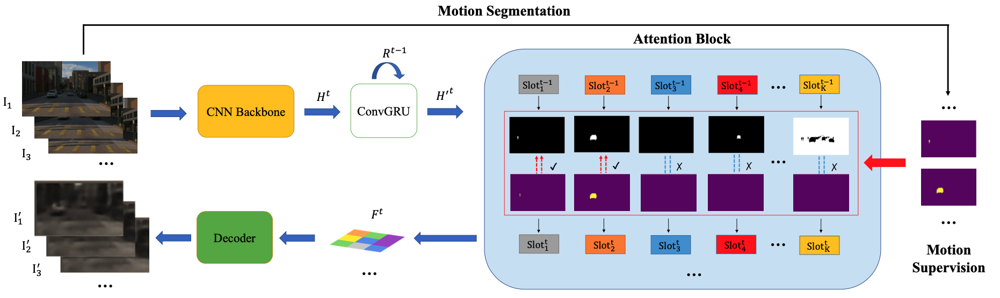

# Discovering Object that Can Move

This is the repository for [*Discovering Object that Can Move*](https://arxiv.org/abs/2203.10159), published at CVPR 2022.  


[[Project Page](https://zpbao.github.io/projects/CVPR22-Discovering/)]
[[Paper](https://openaccess.thecvf.com/content/CVPR2022/html/Bao_Discovering_Objects_That_Can_Move_CVPR_2022_paper.html)]
[[Poster](https://zpbao.github.io/projects/CVPR22-Discovering/image/poster.pdf)]



## Update blogs
`[Jan 2023]`: [[Simplified dataset and Additional data]](https://drive.google.com/drive/folders/1q5AjqhoivJb67h9MZCgUtqb4CooDrZhC?usp=sharing)  
1. Change the download folder from box to google drive, which is easier to download.  
2. Simplified TRI-PD (rgb, flow, and Ground-truth and estimated instance masks) dataset provided.  
3. KITTI estimated masks and test data included.  
4. Pre-trained models provided.  
5. **There are some problems with the raw data links currently, the simplified version is the correct one.**


## Set up

Python 3 dependencies:

* torch 1.7.1+CUDA11.0 
* matplotlib
* cv2
* numpy
* scipy
* tqmd

The default training scipt takes ~15GB*4 for training


## Running code
### pre-processing
To run the model on the TRI-PD dataset, first download PD data and annotations and unzip the tar files. Then run the commend

```python merge_pd.py --pd_dir /A/B --additional_dir /C/D``` 

The full dataset will be merged to the path ```/A/B``` 

The full dataset should be at the following structure:

```
root 
   - scene_000001
      - rgb
         - camera_01
            - 000000000000000005.png
            - ...
         - camera_04
         - camera_05
         - camera_06
         - camera_07
         - camera_08
         - camera_09
      - motion_vectors_2d
      - back_motion_vectors_2d
      - moving_masks
      - ari_masks
      - est_masks
   - scene_000003
   - ...
```

### Train the model 

``` python trianPD.py``` and ```python trainKITTI.py``` 

See ```trainPD.sh``` and ```trainKITTI.sh``` for a sample training script

### Evaluating the pre-trained model

To evaluate or infer on the test set, first download the pre-trained model (or train it with the training code), then run

```python eval.py``` 

to compute the FG.ARI score. We revised the code and fixed some bugs. The ARI score may be slightly different from the reported results in the main paper. 
See ```eval.sh``` for a sample evaluating script.

### Visualize the slot masks

To infer and visualize on a video of arbitary length, see

```PlotPD.py```

for a sample code.

### Pre-trained models

Pre-trained models are located in the pre-trained models folder in [this](https://drive.google.com/drive/folders/1q5AjqhoivJb67h9MZCgUtqb4CooDrZhC?usp=sharing) drive.


## TRI-PD Dataset 

PD datasets:   
[[Raw dataset]](./PD_raw_urls.txt): The full PD dataset contains RGB, semantic segmentation, instance segmentation, optical flow, depth, camera colibrations, 2D/3D bounding boxes, etc. 

Simplified dataset and Additional annotations (moving object masks; dynamic object masks), test data, and pre-trained model:   
[[Additional data]](https://drive.google.com/drive/folders/1q5AjqhoivJb67h9MZCgUtqb4CooDrZhC?usp=sharing) 

Raw PD dataset is connected to TRI's [Vidar](https://github.com/TRI-ML/vidar) project. Leave a message in the issues or contact `zbao@andrew.cmu.edu` for the annotations other than the simplified ones. **Currently the full dataset links are broken, please contact `zbao@andrew.cmu.edu` for potential interests on other annotations.** Will release the full set with a latest work. 


Sample code to transfer the motion vectors to flow xy:

```
rgba = cv2.imread('x.png',-1)
r,g,b,a = rgba[:,:,0], rgba[:,:,1], rgba[:,:,2], rgba[:,:,3]
h,w,_ = flow.shape
dx_i = r+g*256
dy_i = b+a*256
flow_x = ((dx_i / 65535.0)*2.0-1.0) * w
flow_y = ((dy_i / 65535.0)*2.0 - 1.0) * h            
```

## Acknowledgement
The slot attention modules is referred to the [pytorch slot attention](https://github.com/evelinehong/slot-attention-pytorch) and [the official google repo](https://github.com/google-research/google-research/tree/master/slot_attention), the estimated motion segments are generated by [Towards segmenting anything that moves](https://github.com/achalddave/segment-any-moving) repo.

## Citation

```
@inproceedings{bao2022discovering,
    Author = {Bao, Zhipeng and Tokmakov, Pavel and Jabri, Allan and Wang, Yu-Xiong and Gaidon, Adrien and Hebert, Martial},
    Title = {Discorying Object that Can Move},
    Booktitle = {CVPR},
    Year = {2022},
}
```


